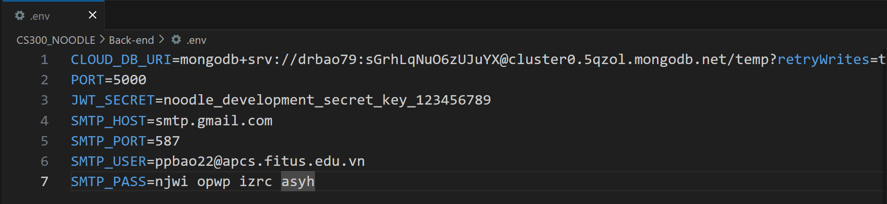
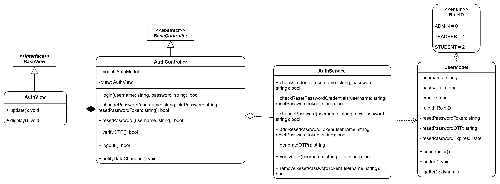

# Documentation

## 1. Backend: Authentication

### a. Setup

The file .env should be configured like the above settings:
- JWT_SECRET is used for login and reset password step
- SMTP_HOST=smtp.gmail.com and SMTP_PORT = 587 is the Gmail's standard SMTP configuration.
- SMTP_USER and SMTP_PASS must be configured with:
  - SMTP_USER: The Gmail address
  - SMTP_PASS: An App Password generated from your Google Account settings
- To generate an App Password:
    - Go to your Google Account settings
    - Navigate to Security
    - Enable 2-Step Verification if not already enabled
    - Under "2-Step Verification", select "App passwords"
    - Generate a new app password for "Mail"
### b. Running
**Testing Environment:**
- Follow setup instructions in guidelines.md
- Access the application at **localhost:5173/auth/login**

**Important Notes:**

- Registration feature is not supported
- Add users/accounts for admin not yet implemented
- Sample account available in database:
    - Location: *Cluster0 → Collections → **temp** database → **users** table*
- To create another accounts/users for testing, fields are required for an account/user:
    - username
    - email
    - password
    - roleId

**Current Feature Status:**
- Available for testing:

    - **Login**
    - **OTP sending**
    - **Password reset**
- **Logout** functionality not yet implemented in frontend

### c. Implementation
- Following the class diagram:

### d. Notes
- The current authentication system uses a basic implementation that includes only essential fields (username, password, and email). This can be changed flexibly after the discussing about designing accounts/users end.
- The discussion should be finished **as soon as possible** to continue to implement another features
